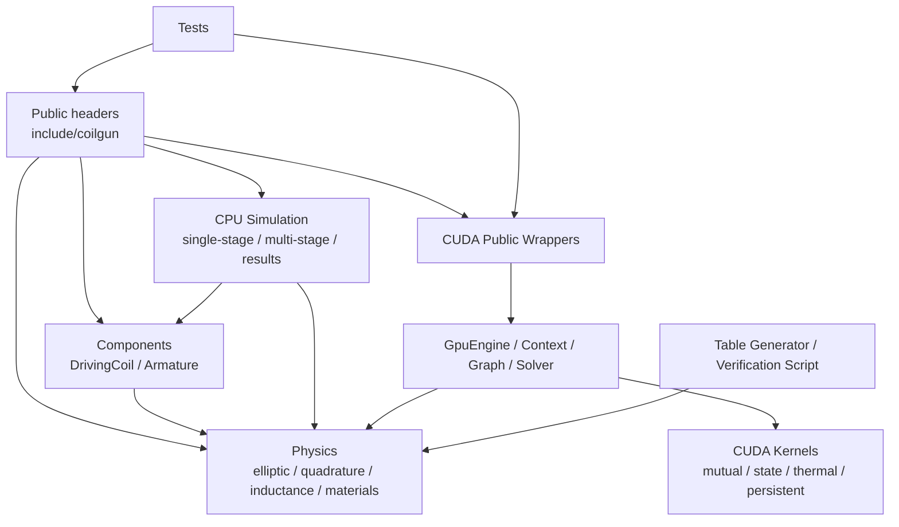

# coligunCalc 全项目静态代码审查报告

> 审查日期：2026-07-20  
> 审查方式：源码静态审查、依赖关系分析、控制流与数值语义复核  
> 审查范围：`include/`、`src/`、`tests/`、`tools/`、`scripts/`、根目录 CMake 配置及公开 API 文档  
> 重要限制：按用户要求，本次未运行构建、CTest、CUDA sanitizer 或性能 benchmark

## 1. 审查目标

本次审查的目标是：

1. 检查 CPU 与 CUDA 实现中可能改变物理结果的正确性问题。
2. 检查公开 API 的输入边界、异常语义和线程安全契约。
3. 检查 CUDA 资源生命周期、并发执行和设备内存边界。
4. 检查模块耦合、重复知识和长期维护风险。
5. 检查测试与构建配置中可能造成假通过、不可移植或验证失真的问题。
6. 给出未被现有设计文档和执行计划覆盖的进一步优化方案。

本报告不是对已有 `docs/audit_report.md` 的替换。已有报告记录的是 2026-07-18 时点的审计状态；本报告针对 2026-07-20 当前工作树进行独立静态复核。

## 2. 去重规则

在提出优化建议前，本次审查完整对照了以下已有设计和执行计划：

- `docs/audit_report.md`
- `docs/superpowers/specs/2026-07-18-gpu-optimization-design.md`
- `docs/superpowers/specs/2026-07-19-unified-adaptive-gpu-engine-design.md`
- `docs/superpowers/plans/2026-07-18-post-audit-fix-plan.md`
- `docs/superpowers/plans/2026-07-18-persistent-kernel.md`
- `docs/superpowers/plans/2026-07-19-unified-adaptive-gpu-engine.md`
- `task_plan.md`
- `findings.md`
- `progress.md`

以下类型的事项不在本报告中重复提出：

- 已经明确列入统一 GPU 引擎实施计划的 wrapper 迁移。
- CUDA Graph 扩展为完整 step pipeline。
- Persistent backend 的专用 control stream 和完整执行接入。
- Standard、Full、Aggressive 的完整精度矩阵。
- Aggressive FP32 椭圆积分的精度验收与 near-singular 处理。
- GPU solver benchmark、静态 planner 阈值校准。
- 双缓冲 CPU/GPU 重叠。
- 结构化 solver、Schur complement、块消元和 cuSPARSE 评估。
- compute-sanitizer 和最终 CUDA 验收。
- GPU thermal、force、energy 的完整逐步 CPU 对比。

若已有计划只覆盖了某个子系统的总体方向，但当前源码存在计划未描述的具体正确性缺陷，本报告仍会记录该缺陷。

## 3. 执行摘要

### 3.1 综合评分

| 维度 | 分数 | 结论 |
|---|---:|---|
| Code Quality | 42/100 | 存在会改变数值结果的时间积分语义错误，以及公共输入边界缺失 |
| Architecture | 72/100 | 目录分层清楚、无明显依赖环，但状态推进职责被拆散在多个对象中 |
| Tech Debt | 55/100 | CPU/GPU 语义重复、隐藏共享状态和文档契约漂移增加维护风险 |
| Test Quality | 66/100 | 测试数量较多，但 GPU 无设备时可能假通过，缺少超时与资源隔离 |
| **Composite Score** | **58/100** | 核心物理基础完整，但应先修正确性和边界问题，再继续性能优化 |

评分只用于表示问题优先级，不代表覆盖率或运行时质量认证。

### 3.2 发现统计

| 严重度 | 数量 | 含义 |
|---|---:|---|
| Critical | 3 | 会系统性改变物理结果、违背公开数值契约或产生未定义行为 |
| High | 5 | 可导致错误状态、设备越界、跨设备错误或明显模型失真 |
| Warning | 8 | 会降低结果可信度、可移植性、可维护性或测试有效性 |

### 3.3 最优先处理的五项

1. 修复 CPU Euler 的电容与热更新顺序。
2. 停止把当前 CPU `RK4Stepper` 描述为完整耦合系统的四阶方法，或完成真正的全状态 RK4。
3. 修复默认互感 API 隐式访问非线程安全全局 LRU 的问题。
4. 为所有公共组件、激励和 CPU 仿真构造接口补齐输入验证。
5. 消除 CUDA GL 常量表和 thermal workspace 的跨 context 共享可变状态。

## 4. 架构概览

### 4.1 当前模块关系



### 4.2 正面评价

- `physics`、`components`、`simulation` 和 `cuda` 的目录职责总体清楚。
- 静态依赖分析没有发现模块依赖环。
- CPU 物理函数、组件对象和仿真包装类之间的层次方向基本合理。
- CUDA 新代码已经开始把 context、solver、graph、thermal 和 state kernel 分离，方向符合统一执行引擎设计。
- 公共头文件与实现文件大体保持一一对应，定位功能较容易。

### 4.3 主要结构风险

当前最大结构问题不是目录组织，而是“一个物理时间步”的状态被多个对象分别拥有：

- 电流、位置和速度在 `SimState`/`MultiStageState` 中。
- 电容电压和 waveform 时间在 `Excitation` 对象中。
- 温度部分在 state 中，但温度相关电阻在仿真对象成员中。
- `M1`、`dM1`、矩阵和 RHS 是仿真对象内的共享 scratch。
- stage 的 triggered/finished 状态在仿真对象的平行数组中。

这使得 `compute_derivatives()` 不是一个只依赖输入状态的纯函数，也使 RK4、回退、历史记录和 reset 很难保持一致。该结构是本次多个正确性问题的共同根因。

## 5. Critical Findings

### C1. CPU `RK4Stepper` 不是完整耦合系统的 RK4

**Symptom**

`RK4Stepper::advance()` 会调用四次导数函数，但传入的状态只包含：

- 电流。
- 电枢位置。
- 电枢速度。
- 可选的丝元温度数组。

以下会影响导数的状态没有参与四个 RK4 子阶段：

- 电容电压。
- Crowbar diode 状态。
- Waveform excitation 时间。
- 温度对应的丝元电阻。
- stage finished/triggered 边界状态。

`Excitation::advance()` 和热更新只在四个子阶段结束后执行一次，因此完整系统仍含 Euler 更新。

此外，`compute_derivatives()` 每次都会覆盖 `M1_`/`dM1_` 或 `M1_mat_`/`dM1_mat_`。RK4 完成后，这些成员保存的是 k4 试探状态的几何梯度，而不是最终加权状态对应的梯度。随后 `record_step()` 使用最终电流和位置配合这组 k4 scratch 计算力。

**Source**

- *Code Complete* — Defensive Programming
- *Refactoring* — Temporal Coupling
- *A Philosophy of Software Design* — Information Leakage

**Evidence**

- `include/coilgun/simulation/time_stepper.hpp:51-57`
- `src/simulation/single_stage_sim.cpp:117-183`
- `src/simulation/single_stage_sim.cpp:213-220`
- `src/simulation/single_stage_sim.cpp:275-284`
- `src/simulation/multi_stage_sim.cpp:236-332`
- `src/simulation/multi_stage_sim.cpp:409-439`
- `src/simulation/multi_stage_sim.cpp:554-570`

**Consequence**

1. 完整电磁、运动、电容和热系统不是四阶精度。
2. 电容和温度状态与 RK4 子阶段电流不在同一时间层。
3. 历史中的力可能对应 k4 试探位置，而不是记录的最终位置。
4. `docs/API.md` 和 `docs/API_cn.md` 中“经典四阶、较高精度”的描述对完整系统不成立。
5. 用户可能通过 RK4 获得比 Euler 更昂贵、但没有所宣称精度阶数的结果。

**Remedy**

推荐将完整积分状态定义为一个单一对象，至少包含：

```text
currents
arm_position
arm_velocity
capacitor_voltage / waveform_time / crowbar_state
filament_temperatures
filament_resistances or enough data to derive them
```

导数函数应满足：

```text
derivative = f(complete_state, immutable_geometry, immutable_config)
```

它不应修改仿真对象成员，不应推进 excitation，也不应留下供历史记录使用的共享 scratch。RK4 提交最终状态后，应按最终状态重新计算记录所需的 `M/dM` 和力。

若短期内不准备完成该重构，应明确拒绝 CPU `RK4Stepper`，与当前 GPU wrapper 的行为保持一致。

**Acceptance Criteria**

- 四个 RK4 子阶段分别使用对应子阶段的电容电压和温度相关电阻。
- `compute_derivatives()` 对相同输入重复调用得到相同输出，且不改变外部对象状态。
- 历史力使用最终提交状态重新计算。
- 文档不再把部分 RK4 描述为完整系统四阶 RK4。

### C2. CPU Euler 使用 post-step 电流推进电容和热状态

**Symptom**

单级路径的顺序为：

```cpp
state_ = stepper_.advance(...);
excitation_->advance(dt_, state_.currents(0));
update_temperatures(state_, dt_);
```

多级路径使用相同顺序。`state_.currents` 在调用 excitation 和 thermal 时已经是新时间层的电流。

项目数值模型中的显式公式要求使用上一步电流：

```text
U_C,n+1 = U_C,n - dt * I_n / C
T_n+1   = T_n + I_n^2 * R_n * dt / (m * cp_n)
```

**Source**

- *Code Complete* — Correctness Before Optimization
- *Domain-Driven Design* — Model Integrity

**Evidence**

- `src/simulation/single_stage_sim.cpp:275-284`
- `src/simulation/single_stage_sim.cpp:195-209`
- `src/simulation/multi_stage_sim.cpp:554-570`
- `src/simulation/multi_stage_sim.cpp:350-365`
- `docs/NumericalModel.md:634-650`

**Consequence**

- 放电初始时刻，正确第一步电容变化和焦耳热应由初始电流决定；初始电流为零时，两者应为零。
- 当前实现会使用第一步刚算出的非零电流，使电容提前放电、温度提前升高。
- 电阻会提前变化，并反馈到下一步电路求解。
- 误差会随较大 `dt` 和较快电流上升而增加。
- CPU 与 GPU 若采用不同顺序，将产生模型语义差异，而不仅是浮点误差。

**Remedy**

每步开始保存 pre-step 状态：

```cpp
const auto previous_currents = state_.currents;
```

然后严格按一种文档化的时间层顺序执行。若以当前 `NumericalModel.md` 为准：

1. 使用 pre-step 状态计算导数。
2. 提交电流、速度和位置的新状态。
3. 使用 pre-step coil current 推进电容或 waveform 时间。
4. 使用 pre-step filament current、pre-step resistance 和 pre-step temperature 计算本步热量。
5. 更新温度相关电阻。

CPU single-stage、CPU multi-stage、GPU wrapper 和 batch 应共用同一份 step contract。

**Acceptance Criteria**

- 初始电流为零时，第一步电容电压和焦耳热不发生变化。
- CPU、GPU 和 batch 对同一 pre-step 状态采用相同的离散顺序。
- 文档明确每个历史字段属于步前还是步后时间层。

### C3. 默认互感 API 隐式访问非线程安全全局 LRU

**Symptom**

无 `use_cache` 参数的以下重载默认访问进程级静态缓存：

- `mutual_inductance_filament(...)`
- `mutual_inductance_gradient_filament(...)`

缓存对象是：

```cpp
static M_cache m_cache;
static M_cache grad_cache;
```

`LRUCache::get()` 并非只读操作，它通过 `list_.splice()` 修改 LRU 顺序；`put()` 同时修改链表和 `unordered_map`。两者均无锁。

API 文档则明确说明无参数重载等价于 `use_cache=false`，并将其描述为线程安全默认路径。这与实现相反。

**Source**

- *Software Engineering at Google* — Hyrum's Law
- *The Pragmatic Programmer* — Orthogonality
- *Clean Architecture* — Hidden Global State

**Evidence**

- `src/physics/mutual_inductance.cpp:42-46`
- `src/physics/mutual_inductance.cpp:53-73`
- `src/physics/mutual_inductance.cpp:103-134`
- `include/coilgun/physics/cache.hpp:33-65`
- `docs/API.md:362-379`
- `docs/API_cn.md:362-379`

**Consequence**

多线程同时调用默认公开 API 时形成标准 C++ 数据竞争，行为未定义。可能表现为：

- 哈希表或链表内部状态损坏。
- 错误缓存命中。
- 偶发崩溃。
- 结果不可复现。

由于默认行为与文档相反，调用者即使遵循文档也无法规避该风险。

**Remedy**

最小修复是让无参数重载委托到无缓存路径：

```cpp
return mutual_inductance_filament(a, b, h, false);
```

对显式 `use_cache=true` 的路径，建议按优先顺序选择：

1. 由调用方持有显式缓存对象。
2. 使用 `thread_local` 缓存。
3. 对 `get()`、`put()`、`clear()` 和 `size()` 施加完整同步。

不要只给哈希查找加锁，因为 `get()` 的 LRU 更新同样修改链表。

**Acceptance Criteria**

- 无参数重载不访问全局共享缓存。
- 文档和实现对默认缓存语义一致。
- 显式缓存路径的线程安全模型由 API 明确说明。

## 6. High Findings

### H1. CPU 公共构造接口缺少基本输入验证

**Symptom**

以下公共类型在计算派生量前没有验证输入：

- `DrivingCoil`
- `Armature`
- `CapacitorExcitation`
- `WaveformExcitation`
- `SingleStageSim`

`MultiStageSim` 验证了容器数量和 trigger config，但仍未验证：

- `dt` 为有限正数。
- 每个 `Excitation` 指针非空。
- excitation 电压有限。
- 组件内部几何和材料参数有效。

**Source**

- *Code Complete* — Defensive Programming

**Evidence**

- `src/components/driving_coil.cpp:17-31`
- `src/components/armature.cpp:16-35`
- `src/simulation/excitation.cpp:12-16`
- `src/simulation/excitation.cpp:37-42`
- `src/simulation/single_stage_sim.cpp:51-62`
- `src/simulation/single_stage_sim.cpp:165`
- `src/simulation/multi_stage_sim.cpp:71-102`

**Examples**

```cpp
DrivingCoil(..., wire_area = 0.0, ...);
Armature(..., m_axial = 0, n_radial = 1, ...);
CapacitorExcitation(450.0, 0.0);
WaveformExcitation({});
SingleStageSim(..., nullptr, 0.0);
```

**Consequence**

- 除零并生成 `Inf` 或 `NaN`。
- 空指针解引用。
- 负质量、负电阻或无效电感进入 ODE。
- `dt == 0` 时状态不推进但循环可持续到 `max_steps`。
- 负 `dt` 时仿真反向推进。
- 错误远离输入边界后才在 Eigen 或 CUDA 层暴露。

**Remedy**

在构造器入口统一执行：

- 所有浮点输入必须有限。
- `outer_radius > inner_radius >= 0`。
- `length > 0`。
- `turns > 0`。
- `wire_area > 0`。
- `0 < fill_factor <= 1`。
- `m_axial > 0`、`n_radial > 0`。
- `mass > 0`、`material_density > 0`、`resistivity > 0`。
- `capacitance > 0`。
- `excitation != nullptr`。
- `dt > 0`。
- waveform function 非空。

校验必须发生在任何除法、`dynamic_cast`、函数调用或指针解引用之前。

**Acceptance Criteria**

- 每个无效公共输入在边界抛出 `std::invalid_argument`。
- 异常消息包含参数名称和约束。
- CPU 与 GPU wrapper 的输入约束一致，除非文档明确说明差异。

### H2. 多级 stage 完成后可能冻结非零残余电流

**Symptom**

当 `finished_[i]` 为 true 时：

- 系统矩阵的该 stage 行只设置单位对角元。
- RHS 对应项保持为零。
- 求解得到的电流导数为零。
- 当前 `state_.currents(i)` 不会被清零。

对 crowbar 而言，通常只有电流已接近零时才 finished；但 `WaveformExcitation` 会在 `end_time` 到达时直接 finished，而不关心线圈电流是否仍显著非零。

**Source**

- *Domain-Driven Design* — Invariant Ownership
- *A Philosophy of Software Design* — Ambiguous State Semantics

**Evidence**

- `src/simulation/multi_stage_sim.cpp:204-224`
- `src/simulation/multi_stage_sim.cpp:301-325`
- `src/simulation/multi_stage_sim.cpp:561-565`
- `src/simulation/multi_stage_sim.cpp:428-436`

**Consequence**

- 求解模型认为 stage 已移除，但公开状态中仍保留残余电流。
- 该电流既不会衰减，也不会归零。
- 历史、峰值和活动时间统计可能被污染。
- 状态对象与电路矩阵对同一个 stage 表达不同物理语义。

**Remedy**

首先定义 `finished` 的领域语义：

- 若表示 stage 已从电路开路移除，则在边界将电流明确置零。
- 若表示电压源结束但线圈仍构成闭合或自由衰减回路，则继续保留 RL/互感方程，直到电流达到阈值后才标记 completed。

建议区分：

```text
excitation_finished
circuit_active
stage_completed
```

不要让一个 `finished_` bool 同时承载三个不同含义。

**Acceptance Criteria**

- 对 waveform 在非零电流下结束的场景，行为有明确物理定义。
- 公开状态、历史记录和系统矩阵对 stage 生命周期保持一致。

### H3. CUDA GL 积分表是跨 stream、跨 engine 共享的可变全局状态

**Symptom**

`gpu_mutual_pipeline.cu` 使用：

```cpp
__constant__ double pipeline_gl_nodes[9];
__constant__ double pipeline_gl_weights[9];
```

每次非 capture 调用都在调用者 stream 上执行 `cudaMemcpyToSymbolAsync()`，随后启动 kernel。单 stream 内顺序正确，但 constant symbol 是整个 CUDA device 共享的，不属于 stream 或 engine。

**Source**

- *The Pragmatic Programmer* — Orthogonality
- *Clean Architecture* — Shared Mutable State

**Evidence**

- `src/cuda/gpu_mutual_pipeline.cu:17-18`
- `src/cuda/gpu_mutual_pipeline.cu:88-93`
- `src/cuda/gpu_mutual_pipeline.cu:191-205`

**Consequence**

多个 engine 或调用在同一 device 的不同 stream 并发时：

- 一个调用可能覆盖另一个正在运行 kernel 使用的节点和权重。
- 不同 `n_nodes` 的调用风险最大。
- 结果会依赖调度时序，难以复现。
- Graph capture 期间跳过上传，使图隐式依赖 capture 外的可变全局状态。

**Remedy**

推荐把 GL 节点和权重存放在：

- `GpuExecutionContext` 所有的只读 device buffer；或
- 每个 graph variant 的稳定 workspace。

kernel 通过参数接收指针。若项目决定所有 GPU 路径永久固定 9 阶，可在每个 device 初始化一次并禁止后续修改，但仍应明确 device 生命周期和初始化同步。

**Acceptance Criteria**

- 两个不同 stream 的 mutual pipeline 不共享可变积分表。
- Graph replay 不依赖 capture 外后来可变的 constant symbol。

### H4. `GpuAdaptor` 的公开传输接口缺少容量检查

**Symptom**

`GpuAdaptor` 分配的容量由 setup 时的 stage、filament 和 batch 数决定，但上传接口按调用方 vector 的长度执行复制：

```cpp
cudaMemcpy(d_seps_, seps.data(), seps.size() * sizeof(double), ...);
```

下载接口接受任意有符号 `n_pairs`，未验证非负和容量上限。相关 `cudaMemcpy` 返回值也被忽略。

**Source**

- *Code Complete* — Defensive Programming
- *Clean Architecture* — Boundary Validation

**Evidence**

- `src/cuda/gpu_adaptor.cu:152-173`
- `src/cuda/gpu_adaptor.cu:181-205`
- `include/coilgun/simulation/cuda/gpu_adaptor.hpp:68-83`

**Consequence**

- 过长 vector 可造成 device buffer 越界写。
- 过大的 `n_pairs` 可造成越界读。
- 负 `n_pairs` 转换为巨大 `size_t` 后可能触发巨量 host 分配和复制。
- CUDA 错误被忽略后，调用者可能继续使用陈旧或部分结果。

**Remedy**

`GpuAdaptor` 应保存：

```text
setup mode
pair capacity
batch pair capacity
current device
initialized state
```

所有传输要求精确长度匹配或明确不超过容量。所有 CUDA Runtime 调用都应检查错误并在消息中包含操作名称。

**Acceptance Criteria**

- 非法长度在 host 边界抛出异常，kernel 或 memcpy 不被调用。
- 负 `n_pairs` 不再可表达，或在转换前被拒绝。
- 每次 CUDA Runtime 错误都会被传播。

### H5. `ThermalWorkspace` 会跨 device 或材料表错误复用设备内存

**Symptom**

`ThermalWorkspace::Impl` 没有记录 owning device。所有 `cudaMalloc` 和 `cudaFree` 都依赖调用线程当前 device。

`update_thermal_batch()` 使用：

```cpp
static thread_local ThermalWorkspace workspace;
```

同一 host 线程切换 device 后，可能继续复用旧 device 的指针。

此外，`initialize()` 只比较：

- 表长度。
- value count。

相同长度但内容或温区不同的材料表不会重新上传。

**Source**

- *A Philosophy of Software Design* — Information Leakage
- *Clean Architecture* — Resource Ownership

**Evidence**

- `src/cuda/gpu_thermal.cu:109-150`
- `src/cuda/gpu_thermal.cu:153-180`
- `src/cuda/gpu_thermal.cu:258-281`

**Consequence**

- device 1 kernel 可能收到 device 0 指针。
- 析构时可能在错误 device 调用 `cudaFree`。
- 相同长度的新表会用新温区索引旧数据。
- 错误通常表现为延迟 CUDA failure 或静默热模型偏差。

**Remedy**

- `Impl` 首次分配时记录 `device_id`。
- 每次 update、resize 和析构通过 device guard 切换到 owning device。
- thread-local cache 至少按 device ID 分桶。
- 表缓存键加入 minimum、maximum 和内容版本或不可变表身份。
- 更推荐由 `GpuExecutionContext` 显式拥有 workspace，取消隐式 thread-local singleton。

**Acceptance Criteria**

- 单线程依次使用两个 device 时，每个 device 有独立 workspace。
- 相同样本数但不同内容的材料表会重新上传。
- workspace 在任何当前 device 下析构都能释放正确资源。

## 7. Warning Findings

### W1. 所有 post-step 历史状态的时间戳少一个 `dt`

**Symptom**

仿真先推进状态，然后以 `step_count_ * dt_` 记录，最后增加 `step_count_`。

因此：

- 第一次记录包含 `t=dt` 的状态，却标记为 `t=0`。
- N 步后的最后记录标记为 `(N-1)dt`。
- summary 直接复制最后记录时间。

**Evidence**

- `src/simulation/single_stage_sim.cpp:213-229`
- `src/simulation/single_stage_sim.cpp:275-285`
- `src/simulation/single_stage_sim.cpp:253-259`
- `src/simulation/multi_stage_sim.cpp:409-441`
- `src/simulation/multi_stage_sim.cpp:554-571`
- `src/simulation/multi_stage_sim.cpp:487-497`

**Consequence**

- 所有曲线整体平移一个时间步。
- `summary.total_time` 恒少一个 `dt`。
- 触发时间、位置和历史样本难以正确对齐。

**Remedy**

如果记录的是 post-step 状态，应使用：

```cpp
entry.time = (step_count_ + 1) * dt_;
```

或先递增计数再记录。更重要的是，在 API 文档中明确每个字段属于步前还是步后时间层。

### W2. `sampled(0)` 会整数除零并产生零步长循环

**Symptom**

两个 `sampled(int every_n)` 都在校验前执行：

```cpp
history.size() / static_cast<std::size_t>(every_n)
```

并以转换后的值作为循环步长。

**Evidence**

- `src/simulation/sim_result.cpp:11-16`
- `src/simulation/multi_stage_result.cpp:11-16`

**Consequence**

- `every_n == 0` 导致整数除零或无限循环。
- 负数转换为巨大无符号值，返回反直觉结果。

**Remedy**

入口要求 `every_n > 0`，否则抛出 `std::invalid_argument`。

### W3. 多级 `step_count_active` 从首次正电流一直计数到全场结束

**Symptom**

汇总中的 `active` 一旦变为 true 就不会恢复 false：

```cpp
if (step.coil_currents[i] > 1e-6) active = true;
if (active) ps.step_count_active++;
```

该逻辑还只识别正电流，忽略负电流幅值。

**Evidence**

- `src/simulation/multi_stage_sim.cpp:499-521`
- `src/simulation/multi_stage_sim.cpp:531-540`

**Consequence**

- 早期 stage 完成后，后续其他 stage 的所有时间步仍计入它的 active count。
- 任意 waveform 的负向大电流不会被识别为 active 或 peak。

**Remedy**

历史记录增加逐步 stage active mask。每个历史样本独立判断 active。若 peak 表示幅值，使用 `max(abs(current))`；若需要保留方向，分别公开最大正值、最小负值和最大幅值。

### W4. `DrivingCoil` 用合法负坐标域作为默认值哨兵

**Symptom**

实现使用：

```cpp
x_(position >= 0.0 ? position : length / 2.0)
```

任何负位置都会被静默替换，而不只是默认参数 `-1.0`。

**Evidence**

- `include/coilgun/components/driving_coil.hpp:29-36`
- `src/components/driving_coil.cpp:28`

**Consequence**

在以炮口、中点或其他参考点为原点的坐标系中，合法负位置会被改写为完全不同的位置，互感和触发结果随之错误。

**Remedy**

使用不含位置参数的重载，或使用 `std::optional<double>` 表达缺省值。不要占用物理坐标域内的数值作为哨兵。

### W5. T 表生成器在线程数较少的平台发生无符号下溢

**Symptom**

```cpp
std::thread::hardware_concurrency() - 4
```

在无符号域先执行。当返回 0 至 3 时发生下溢，`std::max(1u, ...)` 无法兜底。

**Evidence**

- `tools/generate_t_table.cpp:137-155`

**Consequence**

转换到 `int` 后可能得到负数或异常值，随后 `reserve()` 可能尝试巨量分配。

**Remedy**

```cpp
const unsigned hc = std::thread::hardware_concurrency();
const int n_threads = hc > 4 ? static_cast<int>(hc - 4) : 1;
```

同时设置合理上限，避免高核机器为单个生成任务创建过多线程。

### W6. CMake 最低版本声明与实际特性不一致

**Symptom**

项目声明 CMake 3.20，但使用：

- `CMP0167`。
- Preset schema version 6。
- `CMAKE_CUDA_ARCHITECTURES=native`。

唯一 test preset 固定绑定 `ninja-debug`，没有 CUDA test preset。

**Evidence**

- `CMakeLists.txt:1-9`
- `CMakeLists.txt:46-54`
- `CMakePresets.json:2-7`
- `CMakePresets.json:44-55`
- `CMakePresets.json:80-89`

**Consequence**

- 声明支持的旧 CMake 可能无法解析工程。
- 文档中的 CUDA 测试命令若使用 `ctest --preset debug`，实际指向 CPU build 目录。
- CPU preset 未显式关闭 CUDA 时，旧 cache 可能污染配置。

**Remedy**

二选一：

1. 提高并同步真实最低 CMake 版本。
2. 对新 policy 和特性做版本防护，并降低 preset schema。

同时增加 `cuda-debug` test preset，并在 CPU preset 中显式设置 `COILGUN_ENABLE_CUDA=OFF`。

### W7. GPU 无设备时部分测试会被 CTest 记录为普通通过

**Symptom**

多个 CUDA test case 在无设备时打印消息后直接 `return`。测试进程仍返回 0，CTest 将其记为 passed，而不是 skipped。

**Representative Evidence**

- `tests/test_gpu_context_smoke.cpp:7-12`
- `tests/test_gpu_precision.cpp:17-23`
- `tests/test_gpu_thermal.cpp:20-25`
- `tests/test_gpu_paths.cpp:19-25`
- `tests/CMakeLists.txt:36-76`

**Consequence**

- 只有 Toolkit、没有 GPU 的环境可能全绿。
- 驱动不匹配、容器未透传 GPU 或设备不可见可能被隐藏。
- 测试名称给人“kernel 已执行”的错误印象。

**Remedy**

建立两个通道：

- 可选 GPU 通道：无 GPU 时返回专用退出码，并通过 `SKIP_RETURN_CODE` 标记 skipped。
- 强制 GPU 通道：没有 GPU 或没有实际执行 GPU 时失败。

wrapper 测试还应检查 `ExecutionReport` 中的 resolved backend 和 `gpu_executed` 状态，而不只比较最终数值。

### W8. CTest 缺少超时、标签和 GPU 资源互斥

**Symptom**

所有测试只使用：

```cmake
add_test(NAME ${name} COMMAND ${name})
```

没有：

- `TIMEOUT`
- `LABELS`
- `RESOURCE_LOCK`
- `RUN_SERIAL`
- fast/slow/validation 分类

**Evidence**

- `tests/CMakeLists.txt:13-18`
- `tests/CMakeLists.txt:36-76`
- `tests/test_gpu_batch.cpp:30-83`
- `README.md:167-177`
- `README_cn.md:167-177`

**Consequence**

- CUDA 死锁或复杂度退化可无限挂住 CI。
- `ctest -j` 可能让多个目标争用同一 GPU、显存和 context。
- 高成本物理验证拖慢日常开发反馈。
- 旧审计 H2 所记录的 batch 长时间运行问题仍未关闭：当前 README 仍明确说明 `test_gpu_batch` 和 `test_gpu_sim_batch` 在 CUDA Debug 下的限时运行于 120 秒后停止，未观察到自然完成。

`test_gpu_batch` 当前在一个 test case 内顺序执行 10 次 CPU 多级仿真，再运行一个包含 10 个 simulation 的 GPU batch，并逐项比较结果。即使不存在死锁，该结构也把基准规模的计算放入普通集成测试，并且 CTest 本身没有 timeout 或 `slow` 标签。

**Remedy**

建议标签：

```text
unit
physics
integration
gpu
gpu-required
slow
validation
batch
```

为不同标签设置有限 timeout；同一 GPU 使用 CTest resource specification 或 `RESOURCE_LOCK`；外部参考和 80,000 步级别场景移入 slow/validation lane。

旧审计 H2 应视为本项的具体历史证据，而不是已经解决的旧问题。建议把 batch 测试拆成：

1. 小规模、短步数的常规正确性测试。
2. 10 点或更大参数扫描的 `slow`/`validation` 测试。
3. 独立 benchmark，不作为每次常规 CTest 的通过门槛。

## 8. 进一步优化方案

以下方案不重复已有 GPU 统一引擎设计，重点解决本报告中新发现的问题。

### 8.1 P0：修复数值语义和公开契约

#### P0-1 统一完整时间步契约

目标：CPU single-stage、CPU multi-stage、GPU wrapper 和 batch 使用同一时间层定义。

建议定义一个内部 `StepInput`/`StepOutput` 契约：

```text
StepInput
  complete pre-step state
  immutable geometry
  excitation snapshot
  active stage mask

StepOutput
  committed post-step state
  post-step excitation state
  recorded force at committed state
  diagnostics
```

该契约不要求立即统一全部实现代码，但必须先统一顺序和字段语义。

#### P0-2 处理 CPU RK4 契约

可选方案：

1. 完整实现全状态 RK4。
2. 暂时拒绝 CPU RK4 并更新 API 文档。

不建议继续保留当前“部分状态 RK4”并宣称完整四阶精度。

#### P0-3 修复默认互感缓存语义

先让默认重载无缓存且线程安全，再决定显式缓存应由调用方、线程还是 context 拥有。

#### P0-4 建立公共输入验证层

建议在组件和仿真构造器中使用一致的 guard 风格，不需要引入复杂 validation framework。

### 8.2 P1：消除 CUDA 隐式共享状态

#### P1-1 GL 表 context 化

将 GL 表放入 `GpuExecutionContext` 或 graph workspace，并通过 kernel 参数传入。

#### P1-2 Thermal workspace context 化

取消函数级 `thread_local` singleton，让 workspace 由 engine context 显式持有并绑定 device 和材料表版本。

#### P1-3 收紧遗留 `GpuAdaptor`

若 `GpuAdaptor` 仍需保留：

- 将其明确标记为 internal/legacy。
- 收紧可见性。
- 为所有传输增加容量和 mode 校验。
- 统一 CUDA error handling。

若统一引擎迁移后不再需要，应在确认调用点后删除，而不是长期保留双重资源模型。

### 8.3 P1：修复结果和 stage 生命周期模型

#### P1-4 历史记录显式保存时间层

历史对象应明确包含：

- post-step time。
- stage active mask。
- stage completed mask。
- 记录力对应的 state version。

这会消除汇总阶段依赖最终全局 `triggered_`/`finished_` 状态的问题。

#### P1-5 拆分 stage 状态

将 `triggered_` 和 `finished_` 平行 bool 数组替换为更明确的 stage lifecycle：

```cpp
enum class StageState {
    Pending,
    Energized,
    FreeDecay,
    Completed,
    Disabled
};
```

该变化应在修复残余电流语义时一并评估，避免只增加类型而不改变行为。

### 8.4 P2：降低 CPU 仿真重复和热路径成本

#### P2-1 提取纯物理 step core

单级和多级实现重复以下知识：

- 丝元矩阵构造。
- stage-armature `M/dM` 更新。
- 电感矩阵组装。
- 电流 RHS。
- 热更新。
- 历史记录。

建议先提取无副作用的小型内部函数，而不是立即建立大型继承体系。优先提取：

```text
evaluate_geometry
assemble_system
solve_current_derivative
evaluate_force
advance_thermal
```

#### P2-2 合并 CPU `M` 和 `dM` 的 4D 遍历

当前同一几何对先计算 `M`，再执行一次完整 4D 遍历计算 `dM`。可以增加内部组合接口，一次遍历同时累积两者。

公共 API 可以保持不变，仿真热路径直接使用组合接口。

#### P2-3 避免重复创建 GL 节点容器

支持的固定阶数可存为静态只读数组或 span，避免每次积分重新构造动态 vector。

### 8.5 P2：构建和可移植性

#### P2-4 分离默认构建与本机优化

默认 preset 不应强制 `-march=native`。建议增加：

```text
ninja-debug
ninja-release
ninja-native-release
ninja-cuda-debug
```

只在 native preset 中启用本机 ISA。

#### P2-5 替换非标准数学宏

公共 C++17 头文件中的 `M_PI` 和 `INFINITY` 应替换为：

- 项目自己的 `constexpr pi`。
- `std::numeric_limits<double>::infinity()`。

这不是主要正确性问题，但能减少下游编译器差异。

## 9. 建议实施顺序

### Phase 1：正确性基线

1. 修复 CPU Euler 更新顺序。
2. 修复 history 时间戳。
3. 修复 `sampled()` 参数校验。
4. 修复默认 mutual API 缓存语义。
5. 补齐组件、激励和 CPU 仿真输入验证。
6. 明确 CPU RK4 是完整实现还是暂时拒绝。

**完成条件**

- 数值时间层在 API 和代码中有唯一解释。
- 默认公开 physics API 无隐藏数据竞争。
- 无效输入不能产生可继续运行的非有限状态。

### Phase 2：CUDA 所有权与边界

1. GL 表改为 context/variant 所有。
2. Thermal workspace 绑定 device 和材料表版本。
3. `GpuAdaptor` 增加容量、模式和错误检查。
4. 明确 graph、stream 和 workspace 的并发所有权。

**完成条件**

- 多 engine、多 stream 和多 device 不共享未同步可变状态。
- 所有 device 传输在 host 侧验证容量。

### Phase 3：结果模型与 stage 生命周期

1. 修复 finished stage 残余电流语义。
2. 历史增加逐步 stage mask。
3. 修复 active step、signed current peak 和 force 汇总。
4. 统一 trigger、finished、completed 的定义。

**完成条件**

- 历史可以独立重建每个 stage 的生命周期。
- summary 不依赖仿真结束时的全局状态猜测过去行为。

### Phase 4：维护性与性能

1. 提取 CPU 纯物理 step core。
2. 合并 `M/dM` 4D 遍历。
3. 静态化 GL 规则。
4. 整理 CMake 最低版本、preset 和本机优化选项。
5. 对测试增加标签、超时和 GPU 资源隔离。

## 10. `audit_report.md` 旧审计逐项复核

本节逐项核对 `docs/audit_report.md` 中记录的问题和关键结论。复核仅依据当前源码、当前文档、当前测试定义以及仓库已有进度记录；按用户要求，没有重新运行测试。

注意， `docs/audit_report.md` 已经被删除

### 10.1 旧问题状态表

| 旧编号 | 旧审计问题 | 当前状态 | 当前证据与处理 |
|---|---|---|---|
| H1 | `test_gpu_vs_cpu_multi` 出口速度误差约 10% | **旧具体失败不再成立，但未做本次运行验证** | 当前测试已改为 8 步短策略、`GpuOptLevel::Standard`、Direct backend，并要求 `ExecutionReport::gpu_executed`；README 当前将该目标标为通过。旧的 1.80 m/s vs 1.64 m/s 失败数据不再对应当前测试代码，因此不加入新 finding。见 `tests/test_gpu_vs_cpu_multi.cpp:67-106`、`README.md:167`。 |
| H2 | `test_gpu_batch` 120 秒超时 | **仍有明确未关闭证据** | README 当前仍说明 `test_gpu_batch` 和 `test_gpu_sim_batch` 在 CUDA Debug 下运行 120 秒后未自然完成。已合并到本报告 W8，并补充测试工作量和分层方案。见 `README.md:168-177`、`tests/test_gpu_batch.cpp:30-83`。 |
| M1 | `src/coilgun.cpp` 是空桩 | **已修复** | 当前文件包含 `#include <coilgun/coilgun.hpp>`，不再是 placeholder。见 `src/coilgun.cpp:1`。 |
| M2 | GPU 双向缓冲成员是死代码 | **原死成员已删除** | 当前 `gpu_single_stage_sim.hpp` 不再包含 `dbl_M1_`、`dbl_dM1_` 或 `dbl_buf_active_`。双缓冲功能本身仍未实现，但已作为既有后续计划和文档化限制，不作为本报告新问题重复提出。 |
| M3 | `GpuMultiStageSim` 注释错误声称省略 `M_cc_` | **已修复** | 当前头文件改为说明物理推进委托给 `GpuEngine`，已不存在该过时注释。见 `include/coilgun/simulation/cuda/gpu_multi_stage_sim.hpp:1-47`。 |
| D1 | EN/CN 对 Persistent kernel 状态直接矛盾 | **原语言矛盾已修复** | `API.md` 与 `API_cn.md` 当前使用等价表述，均说明后端经 `GpuEngine` 解析并在不允许时回退。见两文件 `Known Limitations` 第 1861 行附近。Persistent 完整接入仍是已有计划项，不重复提出。 |
| D2 | CN Known Limitations 缺少 Double buffering | **已修复** | EN/CN 当前都包含“双缓冲未实现”的等价行。见 `docs/API.md:1863`、`docs/API_cn.md:1863`。 |
| A1 | CN `GpuBackend` 字段表缺少 `use_persistent` | **已修复** | CN 当前包含声明、字段说明和默认值。见 `docs/API_cn.md:1061-1075`。 |
| A2 | CN Known Limitations 缺少 Double buffering | **已修复** | 与 D2 相同，当前双语文档均已包含。 |
| A3 | EN/CN Known Limitations 对同一后端给出相反状态 | **已修复** | 当前 EN/CN 对 Persistent、Fallback 和双缓冲状态的表述已对齐。 |
| A4 | 双语 API 把 `GpuOptLevel` 写成 2 级 | **已修复** | 两文件当前均明确写为 3 级，代码枚举为 `Standard`、`Full`、`Aggressive`。见 `docs/API.md:1577`、`docs/API_cn.md:1577`、`include/coilgun/simulation/cuda/gpu_backend.hpp:26-30`。 |
| R1 | README 声称 17 suites 全部通过 | **已修复** | README 双语版当前写明 CUDA 配置有 28 个 CTest 目标，并分别标注 batch 长运行状态，不再声称全部通过。见 `README.md:41,144-177` 和中文对应位置。 |
| R2 | README 引用不存在的两个文档 | **已修复** | 当前 README 双语版已不存在 `multi_stage_sim_design.md` 和 `test_dataset_82mm_coilgun.md` 引用。 |

### 10.2 旧审计中的总体结论复核

旧报告第 10 行和第 129-130 行认为数值模型“完整覆盖”且 CPU RK4、Euler 和热耦合均已正确落地。当前静态审查表明：相关类型和公式入口确实存在，但“存在实现”不等于“离散语义完全符合模型”。

本报告 C1 和 C2 已具体记录：

- CPU RK4 没有把 excitation 和温度相关电阻纳入四个子阶段。
- CPU Euler 使用 post-step 电流推进电容和热状态。
- RK4 后记录力可能使用 k4 scratch 对应的梯度。

因此，旧审计的“实现覆盖”可以保留为功能清单结论，但不应继续作为数值正确性认证。该偏差已经由 C1/C2 覆盖，不再增加新的重复 finding。

### 10.3 旧测试结果表的适用性

`audit_report.md` 第六节的 16/18 结果是 2026-07-18 的历史快照，不应作为当前工作树的测试状态：

- 当前 CUDA 配置注册 28 个 CTest 目标，而不是 18 个。
- `test_gpu_vs_cpu_multi` 已被大幅改写，旧失败数值不再对应当前测试实现。
- batch 长运行问题仍在当前 README 中明确保留。
- 本次复核没有运行测试，因此不对当前通过数量作新声明。

## 11. 已排除的既有优化

以下事项真实存在或尚未完成，但已经在现有设计/执行计划中明确跟踪，因此不计入本报告的新优化清单：

1. 统一 `GpuEngine` 的 single-stage、multi-stage 和 batch wrapper 迁移。
2. Persistent backend 当前缺少专用 control stream，统一引擎主动 fallback。
3. Persistent kernel generation token、固定 pair index 和完整 active mask 协议。
4. CUDA Graph 当前只捕获 mutual segment，而非完整 step pipeline。
5. Graph capture 异常路径和资源泄漏的最终验收。
6. `GpuOptLevel::Aggressive` FP32 椭圆积分公式和 near-one clamp 的完整修正与验收。
7. Standard、Full、Aggressive 的 `M/dM`、电流、力、位置、速度、温度和能量误差表。
8. CPU Eigen 与 cuSOLVER 的规模阈值 benchmark。
9. Graph、Persistent、Fallback 的性能和一致性 benchmark。
10. 双缓冲 CPU/GPU 重叠。
11. 结构化 solver、Schur complement、块消元和 cuSPARSE。
12. compute-sanitizer、CUDA race 和 misaligned access 验证。
13. GPU thermal、force 和 energy 的完整逐步 CPU 对比。
14. GPU wrapper 的真正 RK4 支持。

## 12. 静态工具结果的人工复核

### 12.1 已确认的误报

静态安全扫描曾将 `tools/generate_t_table.cpp` 中的 `printf`/`fprintf` 标记为 format-string vulnerability。人工复核后确认这是误报：

- format string 均为字面量。
- 外部路径通过 `%s` 参数传入。
- `snprintf` 的格式和参数类型匹配。

真正存在的问题是 `hardware_concurrency() - 4` 的无符号下溢，而不是格式字符串注入。

### 12.2 未采用的风险评分

部分静态工具把物理代码中的 `material`、`key`、`private` 等普通词误识别为安全敏感标志，并把 C++ 测试文件标记为“无测试覆盖”。这些评分只用于定位热点，没有直接写入本报告结论。

## 13. 未验证事项

按用户要求，本次没有运行任何测试或构建，因此以下内容不能从本报告推出：

- 当前工作树能够完整编译。
- CPU CTest 全部通过。
- CUDA CTest 全部通过。
- GPU kernel 在目标硬件上实际执行。
- CUDA Graph、Persistent 或 Fallback 的运行时性能。
- CUDA 资源不存在泄漏。
- 本报告中的每个问题在现有测试参数下都能被触发。

本报告中的正确性结论来自可直接证明的控制流、时间层、内存容量、资源所有权和公开契约分析。后续修复时仍应为每项问题建立最小、聚焦的回归验证，而不需要每次都运行完整长测试套件。

## 14. 结论

项目的物理基础层和总体模块划分已经较完整，当前进一步提升质量的重点不应是继续增加新的 GPU 优化分支，而应先收紧数值语义和状态所有权。

最关键的共同根因是：一个完整时间步所需的状态分散在 state、excitation、thermal resistance、stage flags 和 scratch matrices 中。它直接导致 CPU RK4 不完整、Euler 时间层错位、历史力和时间戳不一致，也使 CPU/GPU 对齐和安全回退变得困难。

建议把“完整 pre-step 状态到完整 post-step 状态”的契约作为下一轮修复的中心，再依次处理线程安全缓存、公共输入验证、CUDA context 所有权和结果生命周期模型。完成这些工作后，现有统一 GPU 引擎计划中的 Graph、Persistent 和 solver 性能优化才有稳定、可信的物理基线。
